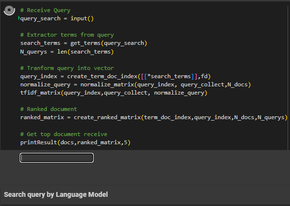
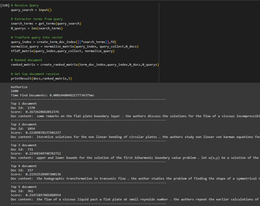
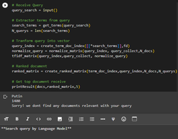
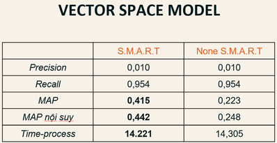
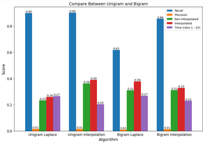

# Bulding Information Retrieval System - Text Retrieval System

|Full name|Student-ID|Role|
|:--:|:--:|:--:|
| [Dang Thi Tuong Vy](https://github.com/TuongVy20522176) |20522176| Leader |
| [Nguyen Hoang Long](https://github.com/LongHoangNguyenH) |20521568| Member |
| Tran Phuong Thao |20521938| Member |

## Table of contents
1. [Introduction](#1-Introduction)
2. [NLP Process](#2-NLP-Process)
3. [Run](#3-Run)
4. [Evaluate](#4-Evaluate)
5. [References](#5-References)
---
## 1. Introduction
Information retrieval is a field need to optimize 

We choose two approach in this repos as Vector Space Model and Language Model
With two model above we compare and using NLP (Natural Language Processing) knowledge, Because we did this repos with English 
and every language has own procedure. It need to be process and using processed data to build Machine Learning model.
Data is used in this repos is Cranfield data - It locate in Data folder.

## 2. NLP-Process (Term Definition)
+ Tokenization
+ Lowercase
+ Remove punctuations
+ remove stopwords
+ steamming
## 3. Run
Clone this repos on your Laptop or PC then extract it.

Find Text_Retrieve.ipynb then run all cells.

This project just built a simple search system, and we have deployed this system into any product, so you can refer to this engine and build your own application.
This is some example:
A box appears, and we type the word that we want to query (everything existed in Cranfield Data)

## 4.Evaluate
+ Vector Space Model
  

+ Language Model
  

+ In general
  

## 5.References
Finally, this is some references and motivation

+ [https://www.ccs.neu.edu/home/jaa/CSG339.06F/Lectures/language.pdf](https://www.ccs.neu.edu/home/jaa/CSG339.06F/Lectures/language.pdf)
+ [https://github.com/whoosh-community/whoosh](https://github.com/whoosh-community/whoosh)

